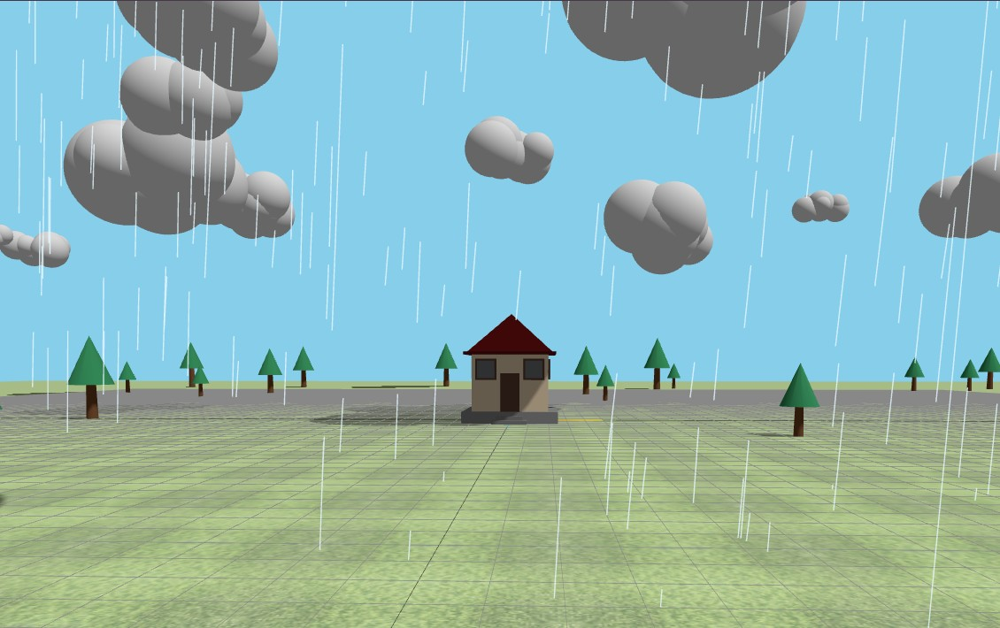
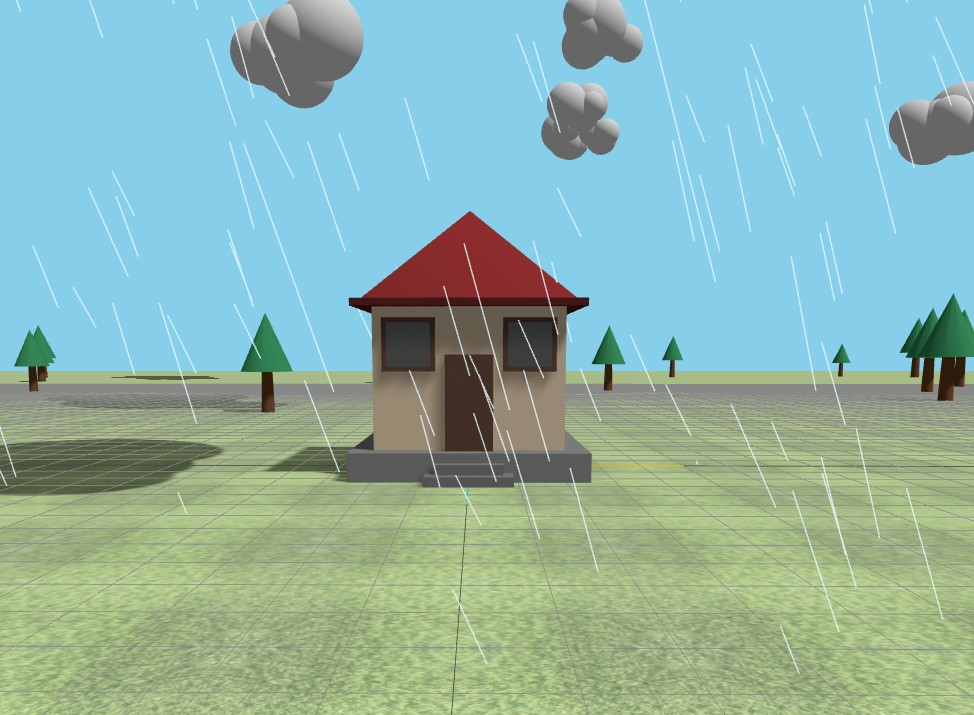
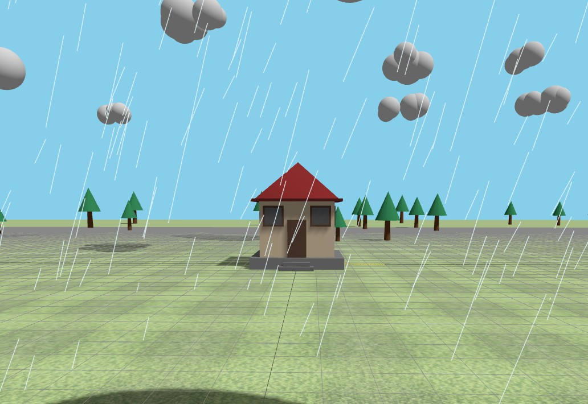
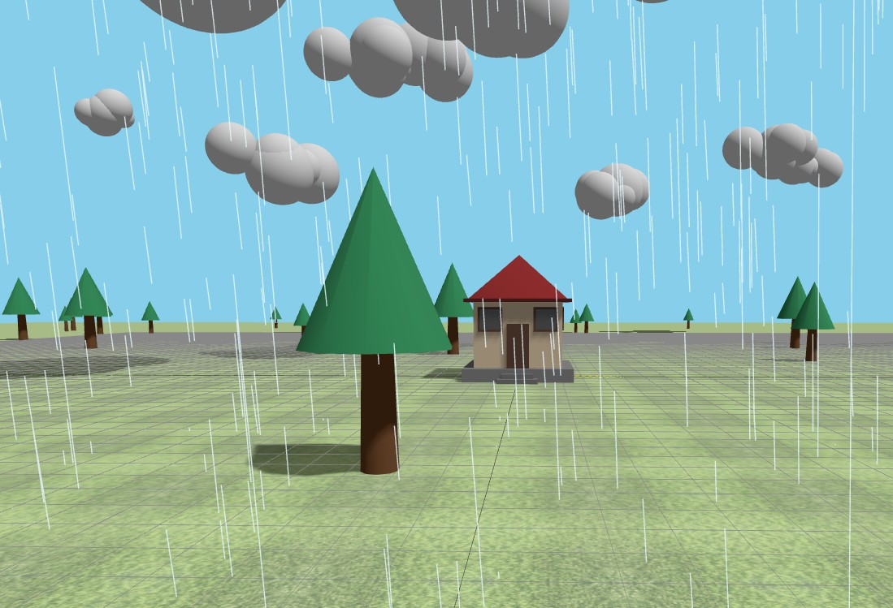
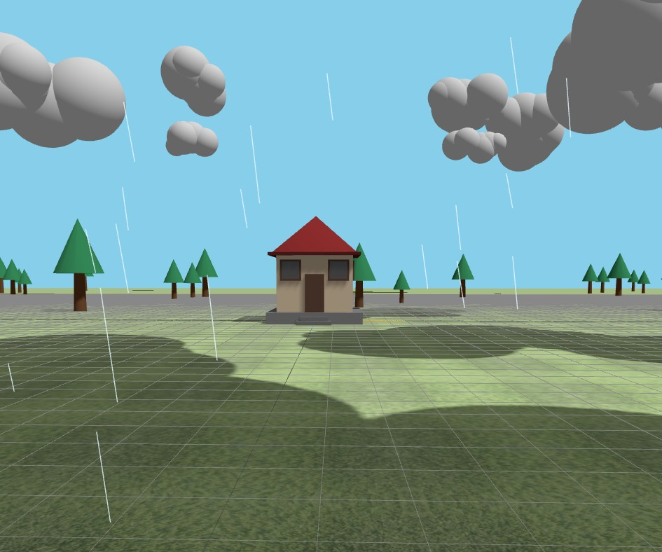

# 🌧️ Interactive Rainfall Simulation

An interactive 3D rainfall simulation built with **Three.js** and **WebGL**, featuring dynamic weather, wind-controlled rainfall, procedural vegetation, and a modular architecture.

## 📸 Preview







---

## ✨ Features

- Dynamic rainfall simulation
- Adjustable rain intensity
- Wind-controlled rain direction
- Procedural forest generation
- Modular house construction
- Dynamic cloud system
- Orbit camera controls
- Real-time lighting

---

## 🎮 Controls

| Key | Action |
|------|--------|
| ↑ | Increase rain intensity |
| ↓ | Decrease rain intensity |
| ← | Wind left |
| → | Wind right |
| Mouse | Rotate camera |
| Scroll | Zoom |

---

## 🛠️ Built With

- Three.js
- WebGL
- JavaScript (ES6)
- HTML5
- CSS3

---

## 📂 Project Structure

```
assets/
├── textures/
screenshots/
src/
├── controls/
├── core/
└── world/
    ├── house/
    ├── lighting/
    ├── terrain/
    ├── vegetation/
    └── weather/
```

---

## 🚀 Getting Started

1. Clone the repository.

```bash
git clone https://github.com/yourusername/interactive-rainfall-simulation.git
```

2. Open the project in **Visual Studio Code**.

3. Right-click `index.html`.

4. Select **Open with Live Server**.

## 👤 Author

**Khadizatul Kobra**

Computer Science & Engineering

GitHub: https://github.com/MKKobra

LinkedIn: https://www.linkedin.com/in/k08ra/